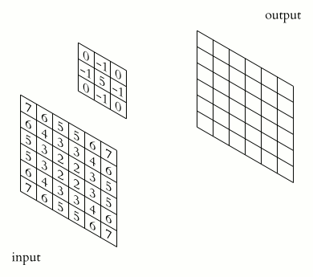

# POW - 11

## Create a class `ConvNet()` to implement a 2D convolutional network and max pooling

Create a python script to implement a basic 2D convolutional network and max pooling architecture from scratch.

The hierarchy for the class is as follows:

```
ConvNet (class)
    ├── Conv2D (class)
    └── MaxPool (class)
```
The 2D convolution layer and max pooling layers must be inside the parent class `ConvNet` as shown in the hierarchy above.

The `Conv2D` takes in 3 parameters - `stride`, `padding` and `kernel_size`.

The `MaxPool` takes in 2 parameters -  `image` and `kernel_size`.

*Convert the image to grayscale before doing convolution.*



#### Prerequisites
- Matplotlib or OpenCV
- NumPy

